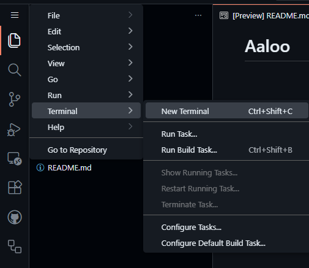

# How to get a demo of this game?

- Go to <a href='https://github.dev/bhatrichit10-ux/aaloo'>Github Dev </a>
- Go to Menu Bar > Terminal > New terminal

- Click on Continue Working in Github Codepspaces
- CLick on The 2GB Ram option on the top searchbar
- Wait for a few seconds
- Go to its terminal and write ` bash ./install.sh`
- Run using `node .`