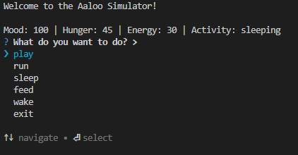
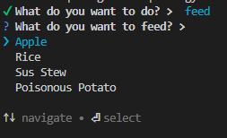
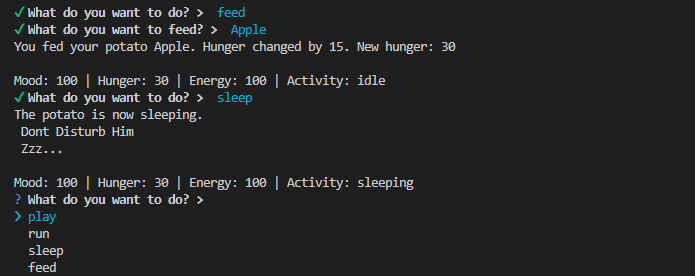
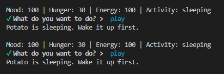
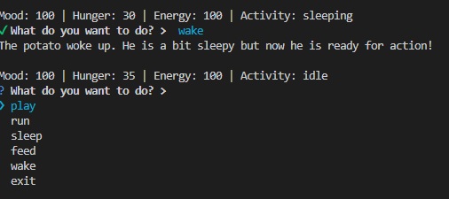

<h1 align="center">Welcome to aaloo 👋</h1>
<p>
  
</p>

> a virtual pet potato that performs random culinary tasks when fed!

### 🏠 [Homepage](https://github.com/bhatrichit10-ux/aaloo#readme)

## Install
```
git clone https://github.com/bhatrichit10-ux/aaloo
cd aaloo
npm install
node .
```
## Images
 <br>
---
 <br>
---
 <br>
---
 <br>
---
 
## Author

👤 **Richit Bhat**

* Github: [@bhatrichit10-ux](https://github.com/bhatrichit10-ux)

## Show your support

Give a ⭐️ if this project helped you!

## 📝 License

Copyright © 2025 [Richit Bhat](https://github.com/bhatrichit10-ux).<br />
This project is [ISC](https://github.com/bhatrichit10-ux/aaloo/blob/master/LICENSE) licensed.

***
